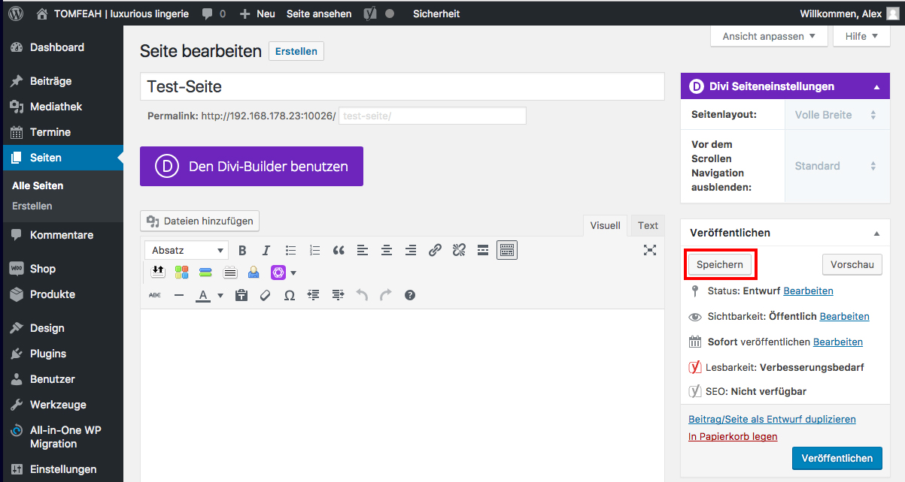

# Seite bearbeiten (2/2)

Jetzt kannst du deine Seite bearbeiten (wie genau erfährst du in dem Kapitel "Divi-Builder") und dann "speichern" nicht vergessen.

## Hinweis
Wenn du den Titel im nach hinein änderst, achte darauf, ob du auch den Permalink dazu ändern möchtest (URL unter der die Seite angezeigt wird).

