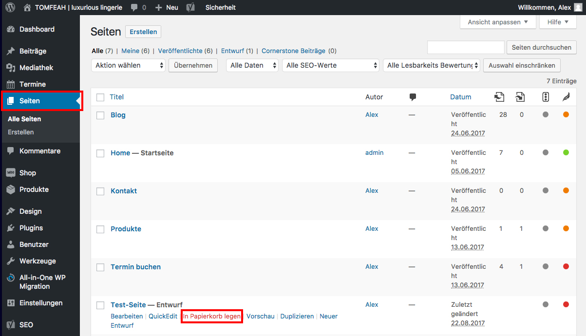

## Seite löschen

Wenn du im Seitenmenü auf "Seiten" klickst, wird dir eine Übersicht deiner Seiten angezeigt.

Halte den Mauszeiger über die Seite, die du löschen möchtest und klicke auf "In Papierkorb legen".

