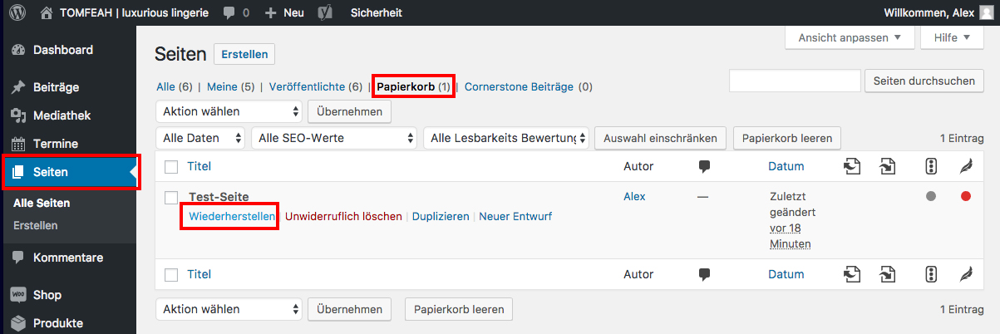

## Seite wiederherstellen

Um eine gelöschte Seite wiederherzustellen, navigiere in der Seitenleiste zu "Seiten" und klicke auf „Papierkorb“.

Wähle nun die Seite aus, die du wiederherstellen möchtest, halte den Mauszeiger darüber und klicke auf „Wiederherstellen“.

