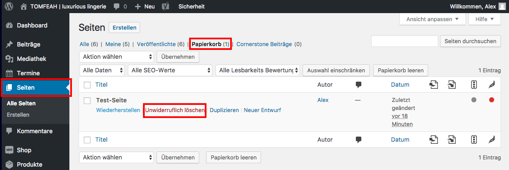

## Seite unwiderruflich löschen

Um eine gelöschte Seite unwiderruflich zu löschen, navigiere in der Seitenleiste zu "Seiten" und klicke auf „Papierkorb“.

Wähle nun die Seite aus, die du wieder unwiderruflich löschen möchtest, halte den Mauszeiger darüber und klicke auf Unwiderruflich löschen.

