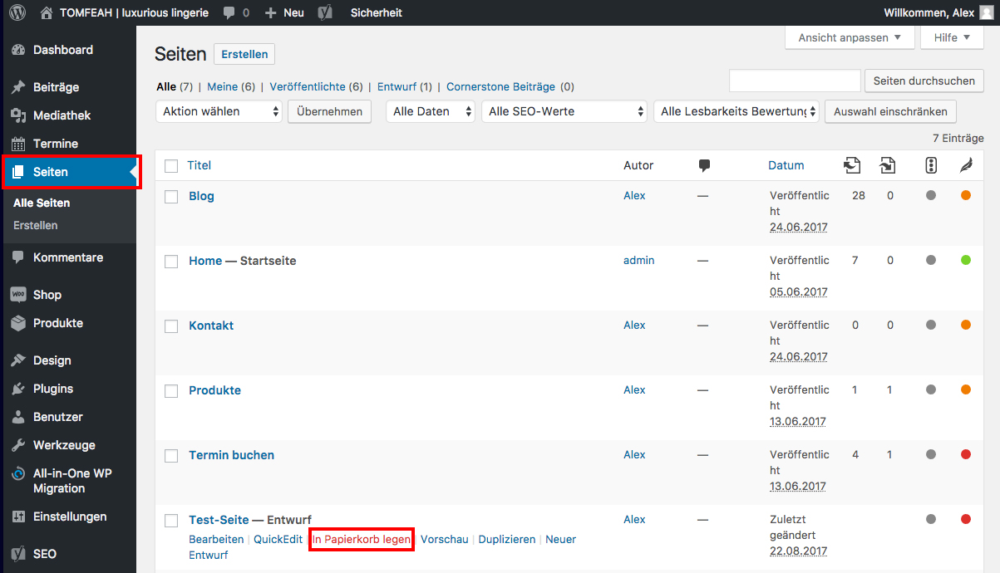

## Beitrag löschen

Wenn du im Seitenmenü auf "Beiträge" klickst, wird dir eine Übersicht deiner Beiträge angezeigt.

Halte den Mauszeiger über den Beitrag, den du löschen möchtest und klicke auf "In Papierkorb legen".

