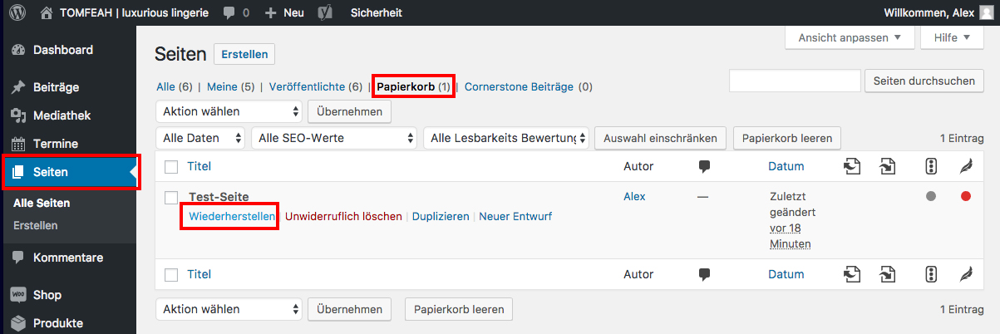

# Beitrag wiederherstellen

Um einen gelöschten Beitrag wiederherzustellen, navigiere in der Seitenleiste zu "Beiträge" und klicke auf „Papierkorb“.

Wähle nun den Beitrag aus, den du wieder herstellen möchtest, halte den Mauszeiger darüber und klicke auf „Wiederherstellen“.

