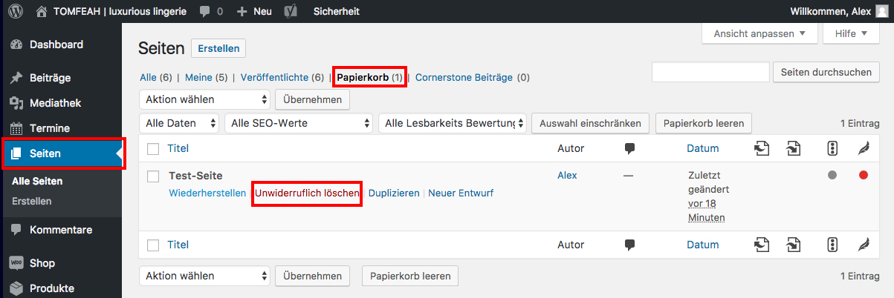

## Beitrag unwiderruflich löschen

Um einen gelöschten Beitrag unwiderruflich zu löschen, navigiere in der Seitenleiste zu "Beiträge" und klicke auf „Papierkorb“.

Wähle nun den Beitrag aus, den du wieder unwiderruflich löschen möchtest, halte den Mauszeiger darüber und klicke auf Unwiderruflich löschen.

