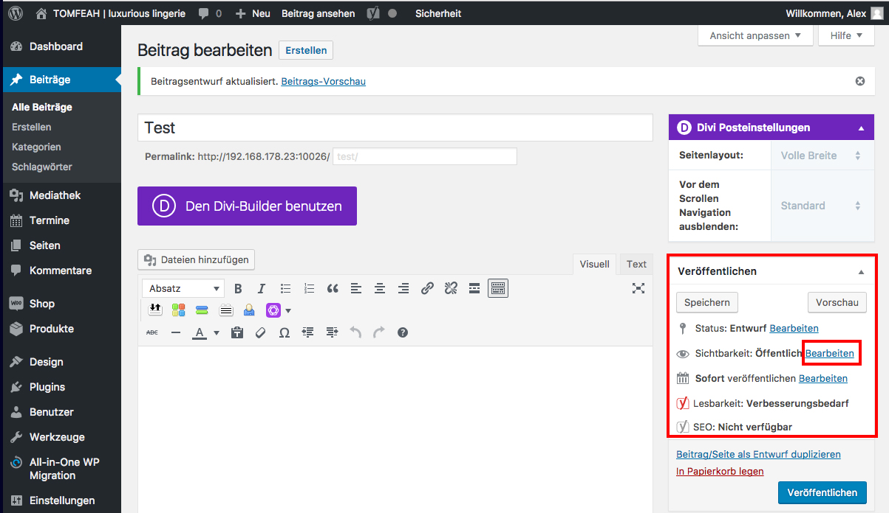

# Veröffentlichen - passwortgeschützt (1/3)

Um eine Seite oder einen Beitrag nur für bestimmte Nutzer freizuschalten, klicke im Reiter Veröffentlichen unter dem Punkt "Sichtbarkeit: Öffentlich" auf "Bearbeiten".

