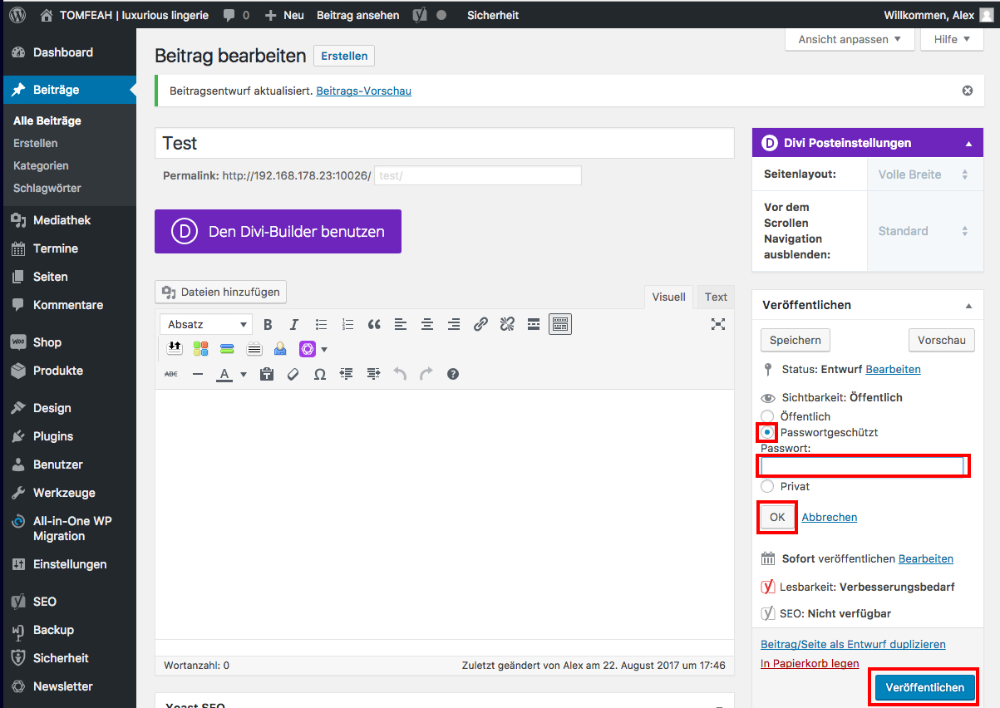

## Veröffentlichen - passwortgeschützt (2/3)

Wähle "Passwortgeschützt", vergib ein Passwort und klicke dann auf "OK".

Abschließend klicke auf "Veröffentlichen" um die Seite/Beitrag freizuschalten.

