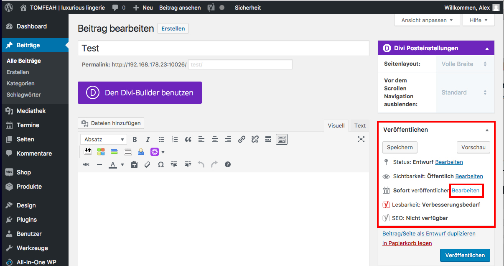

# Veröffentlichen - mit Verzögerung (1/5)

Um eine Seite oder einen Beitrag zu einem bestimmten Zeitpunkt zu veröffentlichen, klicke im Reiter Veröffentlichen unter dem Punkt "Sofort veröffentlichen" auf "Bearbeiten".

