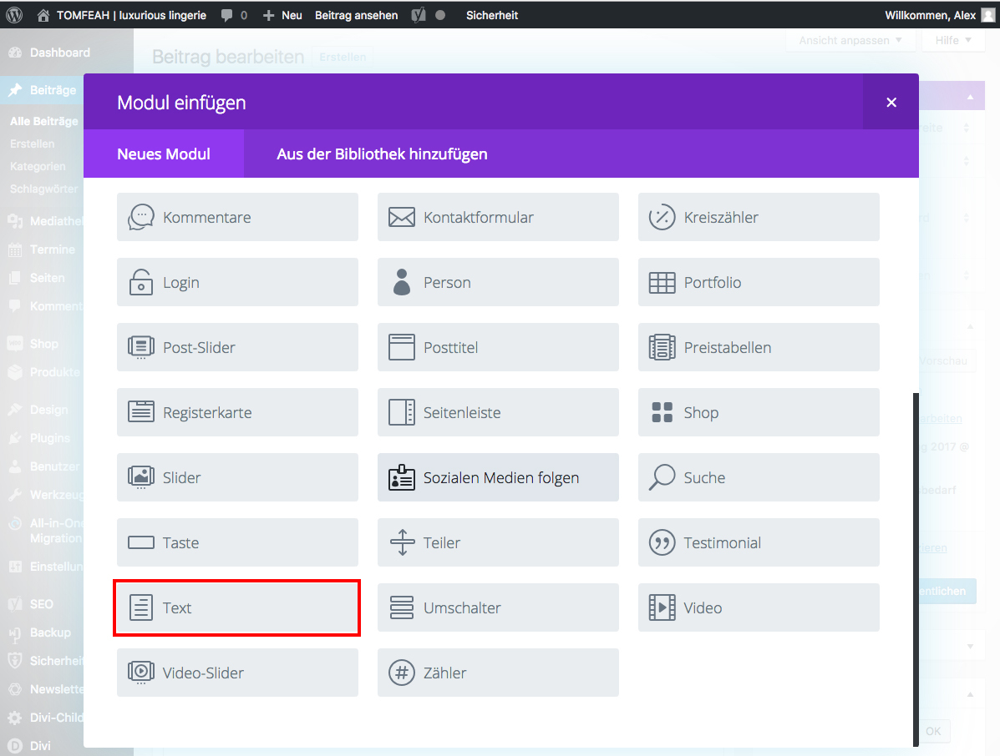

## Was ist ein Modul?

Ein Modul ist z.B. ein Text oder ein Bild, was in einer Spalte platziert werden kann und am Ende auf der Webseite dargestellt wird.

Divi bringt eine Vielzahl von Modulen mit:

