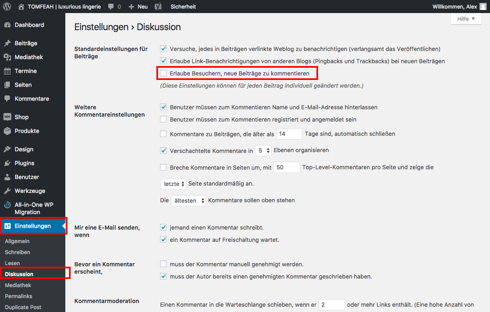

## Kommentare aktivieren/deaktivieren (1/3)

Alle Grundeinstellungen zu Kommentaren findet man unter "Einstellungen / Diskussion".

Der wichtigste Schalter für die Kommentare heißt "Erlaube Besuchern, neue Beiträge zu kommentieren".

Hiermit wird global für die gesamte Webseite die Kommentarfunktion ein- oder ausgeschaltet.

