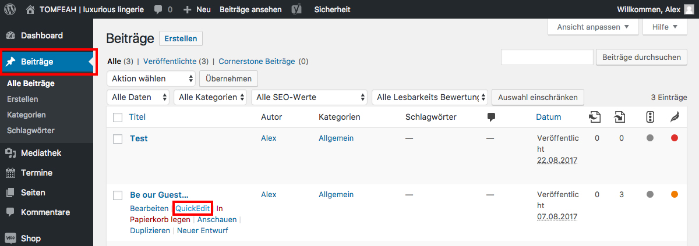

# Kommentare aktivieren/deaktivieren (2/3)

Die Änderung der Einstellung wirkt sich nur auf zukünftigeSeiten/Beiträge aus.

Alle bereits vorhandenen Beiträge/Seiten behalten die vorherige Einstellung.

Um die Kommentar-Funktion für bereits vorhandene Beiträge/Seiten freizuschalten, verwende die "Quick Edit" Funktion, welche man unter Beiträge/Seiten findet.

