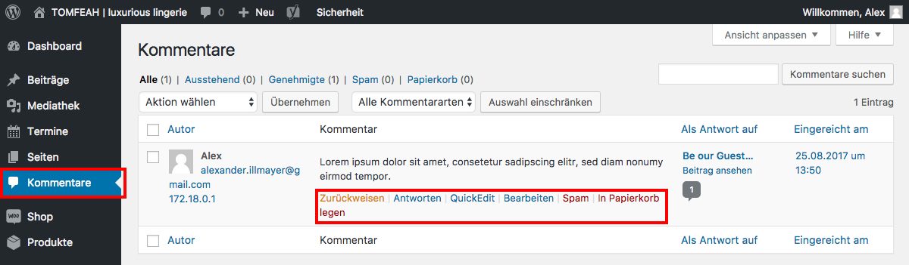

# Kommentare verwalten

Wenn die Kommentar-Funktion für Beiträge/Seiten freigeschaltet ist, erfolgt die Verwaltung von Kommentaren im Menüpunk “Kommentare“.

Hier kann man löschen, zurückweisen, antworten, …

