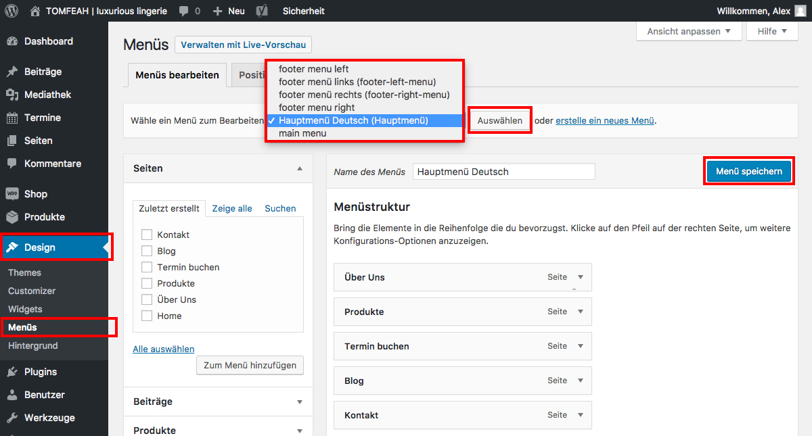

## Menüs verwalten (1/2)

Um die Menüs zu verwalten, klicke auf "Design / Menüs".

Wenn mehrere Menüs angelegt wurden, achte darauf im richtigen Menü zu sein.

Mittels Drag&Drop kann die Anordnung der Menü-Punkte verändert werden.

Zum Speichern nach Änderungen klicke "Menü speichern".

