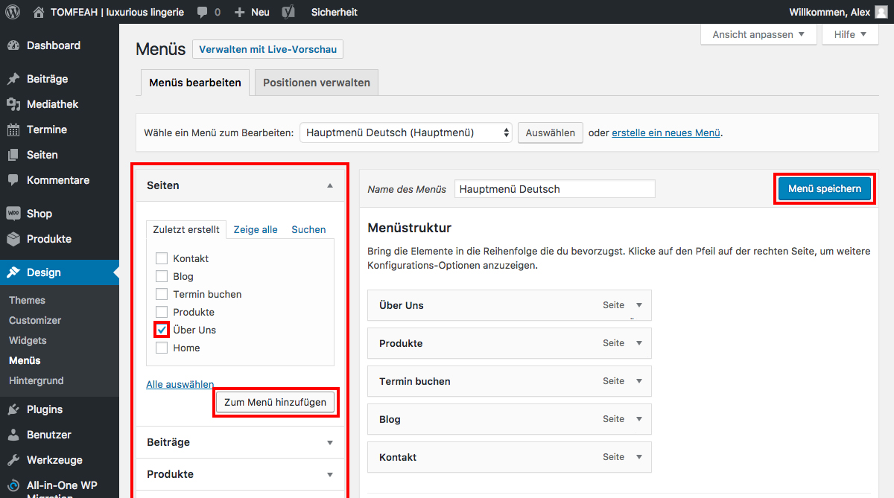

# Menüs verwalten (2/2)

Um neue Menü-Punkte hinzuzufügen, wähle aus der linken Spalte die gewünschte Seite/Beitrag und klicke auf "Zum Menü hinzufügen".

Bestimme die Postion mittels Drag&Drop und klicke zum Speichern "Menü speichern".

