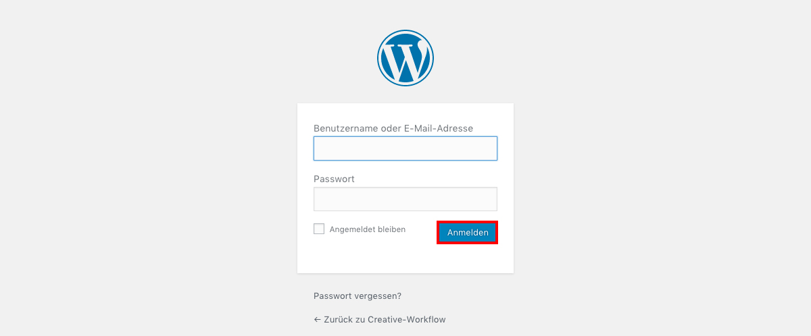

# Login im Backend

Das Backend erreichst du unter der Domain deiner Webseite mit dem Anhang `/wp-admin`.

Also z.B.: `http://www.meine-webseite.de/wp-admin`.

Hier gibst du deine Login-Daten ein und klickst auf _*Anmelden*_.

