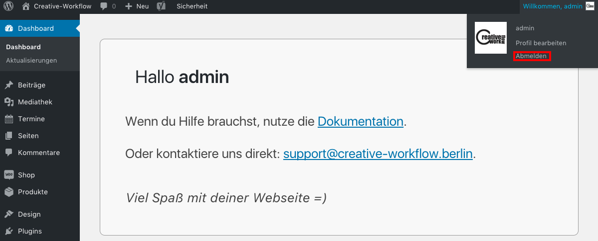

# Abmelden

Wenn du mit deiner Arbeit fertig bist und du z.B. an einem öffentlichen PC oder nicht an deinem eigenen PC gearbeitet hast, melde dich ab in dem du im Kopfzeilenmenü die Maus über *Wilkommen ...* hältst und auf *Abmelden* klickst.

