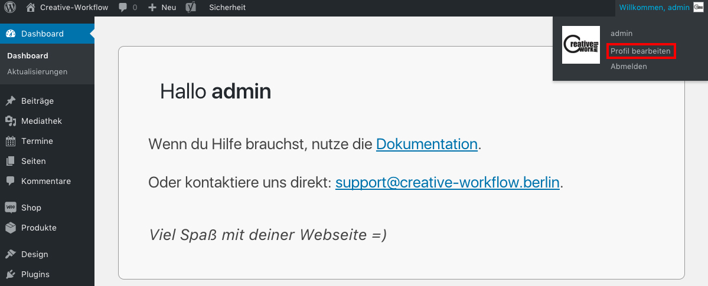

# E-Mail und Passwort ändern

Um die **E-Mail-Adresse** zu ändern, mit der du bei deiner Webseite registriert bist oder um dein **Login-Passwort** zu ändern, halte die Maus über _*Wilkommen ...*_ im Kopfzeilenmenü und klicke auf _*Profil bearbeiten*_.

Auf der folgenden Seite kannst du die gewünschten Einstellungen vornehmen. Vergiss nicht, deine Änderungen zu speichern.

