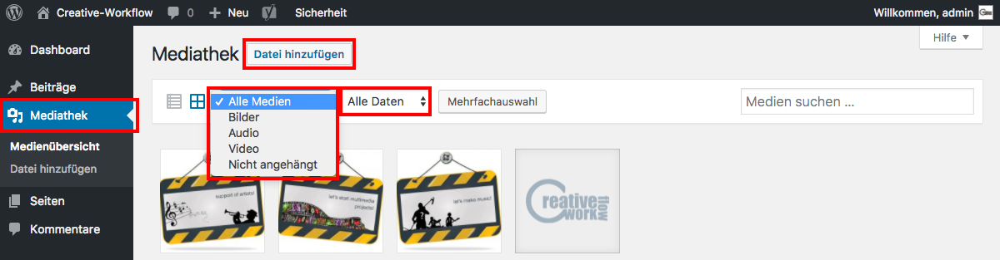

## Was ist eine Mediathek?

In der Mediathek werden sämtliche Medien verwaltet, die du innerhalb von Wordpress hochgeladen hast.

Dies geht zum einen während der Erstellung von Beiträgen und Seiten, ist aber auch unabhängig davon über den Menüpunkt _**Datei hinzufügen**_ möglich.

