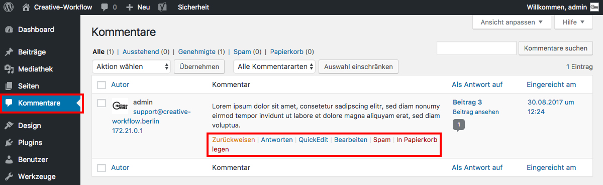

## Kommentare verwalten

Wenn die Kommentar-Funktion für Beiträge/Seiten freigeschaltet ist, erfolgt die Verwaltung von Kommentaren unter dem Seitenmenü _**Kommentare**_.

Hier kann man löschen, zurückweisen, antworten, …

