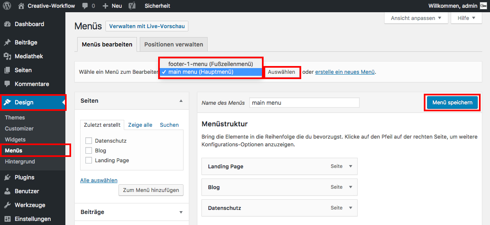

## Menüs verwalten *(1/2)*

Um die Menüs zu verwalten, klicke im Seitenmenü auf _**Design/Menüs**_.

Wenn mehrere Menüs angelegt wurden, achte darauf, im richtigen Menü zu sein.

Mittels Drag&Drop kann die Anordnung der Menü-Punkte verändert werden.

Um deine Änderungen zu speichern klicke _**Menü speichern**_.

