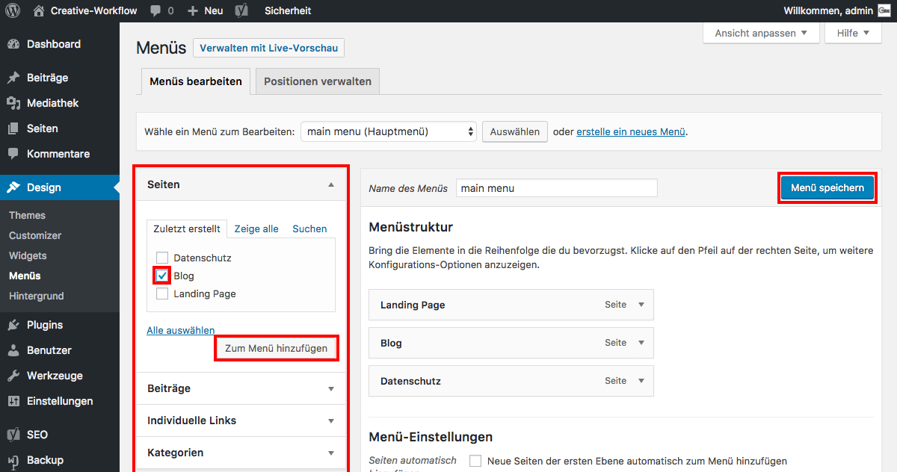

## Menüs verwalten *(2/2)*

Um neue Menü-Punkte hinzuzufügen, wähle im linken Widget die gewünschte Seite/den Beitrag und klicke auf _**Zum Menü hinzufügen**_.

Bestimme die Postion mittels Drag&Drop und speichere deine Änderungen mit _**Menü speichern**_.

