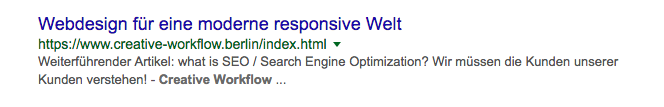

## Worum geht es eigentlich?

Es geht darum wie deine Webseite im Internet von deinen Kunden gefunden werden kann.

Es geht um **Suchmaschinen-Optimierung**.

### ...es geht um die Suchergebnis-Platzierung und Darstellung:

