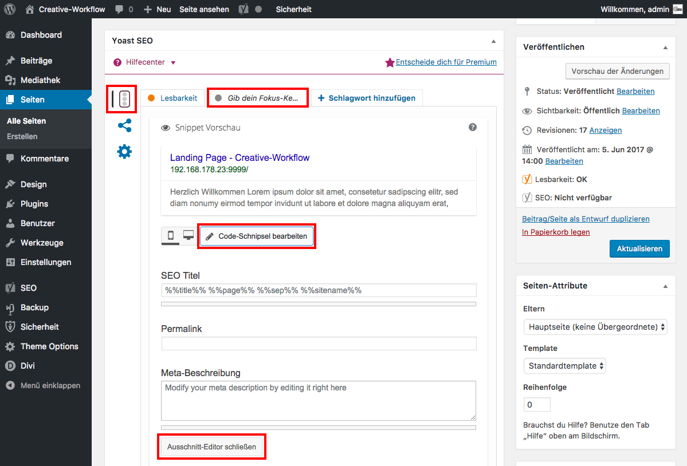

## Yoast SEO: "Snippet"-Bearbeiten *(2/5)*

Unter dem Seiten-Tab "Optimierung der Inhalte" im Tab "Gib dein Fokus-Keyword ein" kann man das Snippet bearbeiten. Klicke dazu auf "Code-Schnipsel bearbeiten".

In der Fachsprache nennt man dieses "Snippet" auch "Serp" (Search-Engine-Result-Page).

