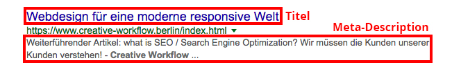

## Wie kann ich optimieren?

Du kannst z.B. **regelmäßig** neue Beiträge mit **relevanten** Inhalten erstellen.

**Hinweis**: Die Suchmaschine bezieht unter anderem die Besuchsdauer eines Lesers in die Relevanzbestimmung mit ein.

Außerdem kannst du bestimmte unsichtbare **Zusatzangaben** zu einem Betrag oder einer Seite machen.

Du kannst z.B. den Titel und den Kurztext (Meta-Description) deiner Suchergebnis-Darstellung beeinflussen.

