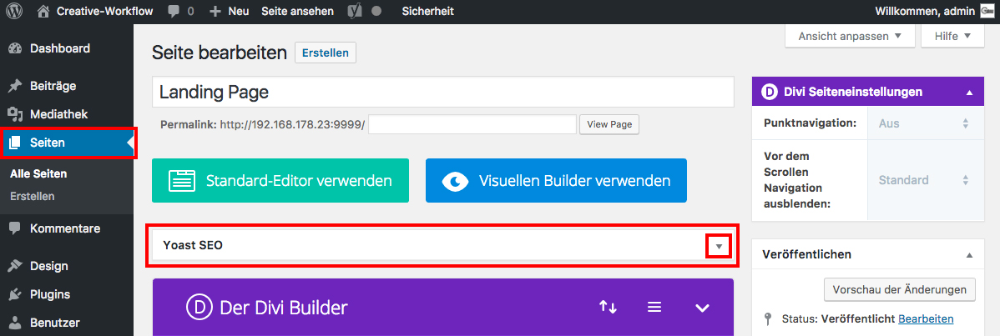

## Yoast SEO - Widget

Mit Yoast SEO kannst du für jeden Beitrag und jede Seite den Titel und die Meta-Description einstellen.

Dazu dient das _**Yoast SEO Widget**_, das du aufklappen und editieren kannst.

