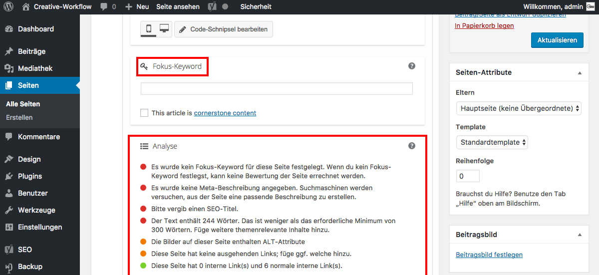

## Yoast SEO - Fokus-Keyword

Der Abschnitt _**Fokus-Keyword**_ dient dazu dir zu helfen, einen Beitrag oder eine Seite auf ein Bestimmtes Wort (Keyword) hin zu optimieren.

Der Abschnitt _**Analyse**_ zeigt dir, wo noch Verbesserungspotential besteht.

