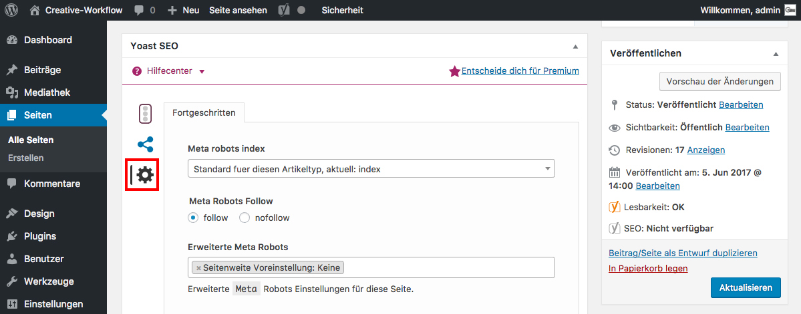

## Yoast SEO: Crawler *(2/2)*

### Meta robots index
  * **index**: Nehme diese Seite in den Such-Index auf.
  * **noindex**: Nehme diese **nicht** Seite in den Such-Index auf.

### Meta robots follow
  * **follow**: Nehme Links zu anderen Seiten in den Such-Index auf.
  * **nofollow**: Nehme **keine** Links zu anderen Seiten auf.

