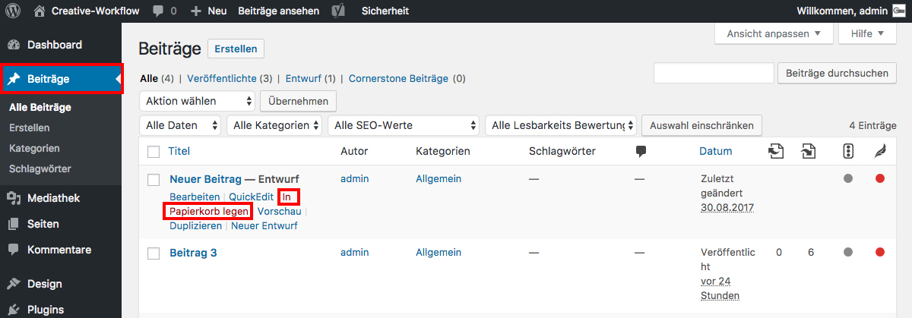

## Beitrag löschen

Wenn du im Seitenmenü auf _**Beiträge**_ klickst, wird dir eine Übersicht deiner Beiträge angezeigt.

Halte den Mauszeiger über den Beitrag, den du löschen möchtest und klicke auf _**In Papierkorb legen**_.

