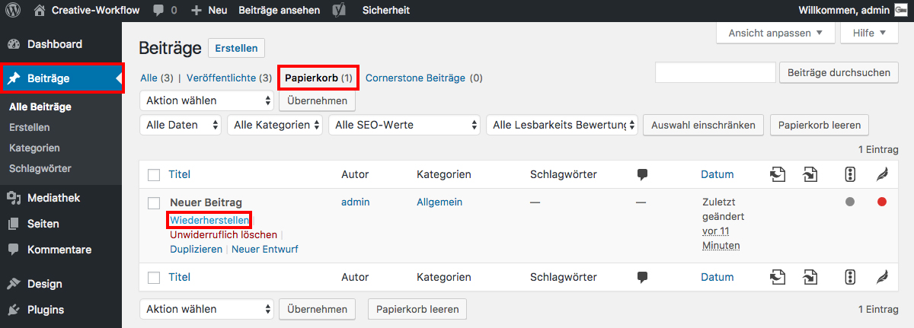

## Beitrag wiederherstellen

Um einen gelöschten Beitrag wiederherzustellen, navigiere im Seitenmenü zu _**Beiträge**_ und klicke auf den Reiter _**Papierkorb**_.

Wähle nun den Beitrag aus, den du wiederherstellen möchtest, halte den Mauszeiger darüber und klicke auf _**Wiederherstellen**_.

