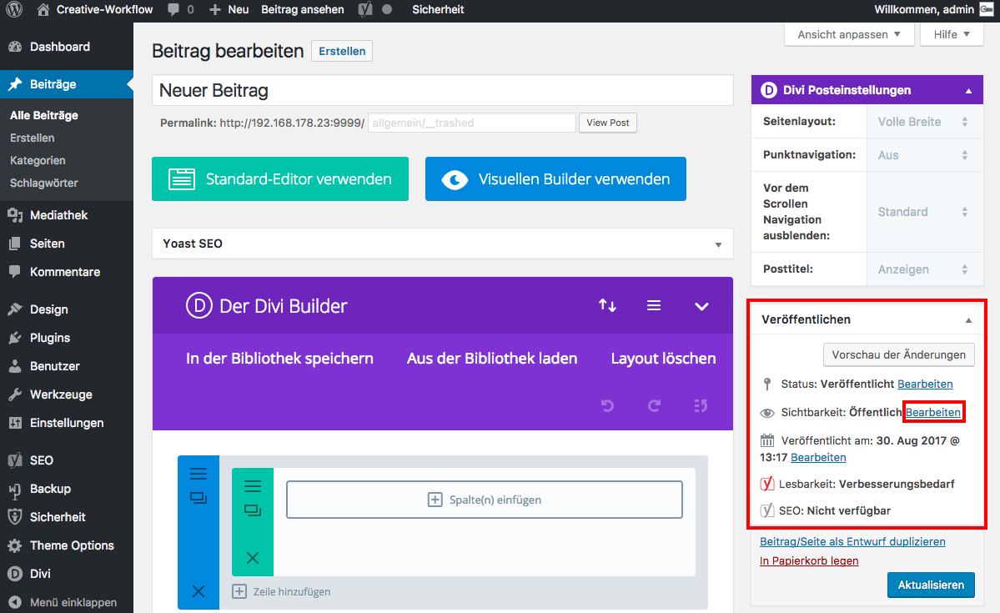

## Veröffentlichen - passwortgeschützt *(1/3)*

Um eine Seite oder einen Beitrag nur für bestimmte Nutzer freizuschalten, klicke im Widget _**Veröffentlichen**_ unter dem Punkt _**Sichtbarkeit: Öffentlich**_ auf _**Bearbeiten**_.

