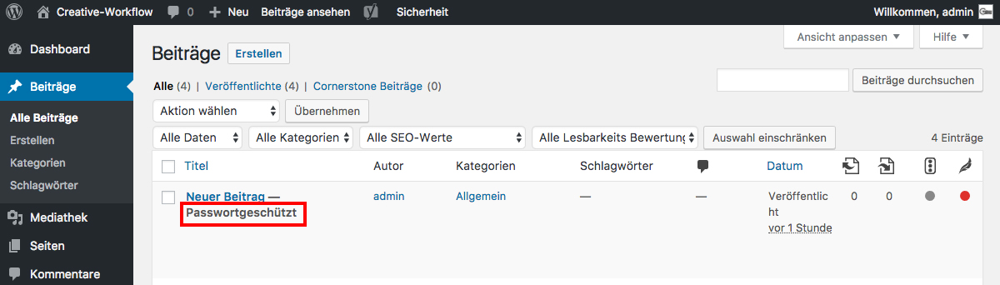

## Veröffentlichen - passwortgeschützt *(3/3)*

Der Inhalt der Seite/des Beitrages ist nun zwar öffentlich, aber mit einem Passwort geschützt (Status _**Passwortgeschützt**_).

Wenn ein Besucher die Seite oder den Beitrag öffnet, wird er aufgefordert ein Passwort einzugeben.

