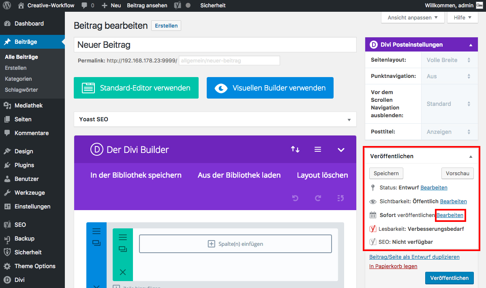

## Veröffentlichen - mit Verzögerung *(1/5)*

Um eine Seite oder einen Beitrag zu einem bestimmten Zeitpunkt zu veröffentlichen, klicke im Widget _**Veröffentlichen**_ unter dem Punkt _**Sofort veröffentlichen**_ auf _**Bearbeiten**_.

