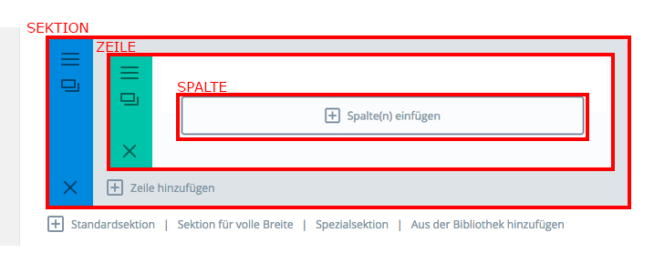

## Was ist ein Grid?

Ein "Grid" teilt die Seite in ein Raster ein.

Eine Seite ist von oben nach unten in **Sektionen** eingeteilt.

Eine Sektion kann ein oder mehrere **Zeilen** beinhalten.

Eine Zeile besteht aus ein oder mehreren **Spalten** in die Module eingefügt werden.

