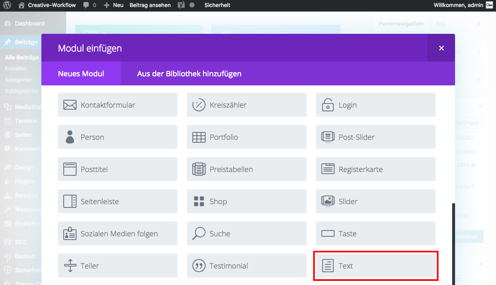

## Was ist ein Modul?

Ein **Modul** ist z.B. ein Text oder ein Bild, das in einer Spalte platziert werden kann und im Frontend auf deiner Webseite dargestellt wird.

Der **Page-Builder** bringt eine Vielzahl von Modulen mit:

