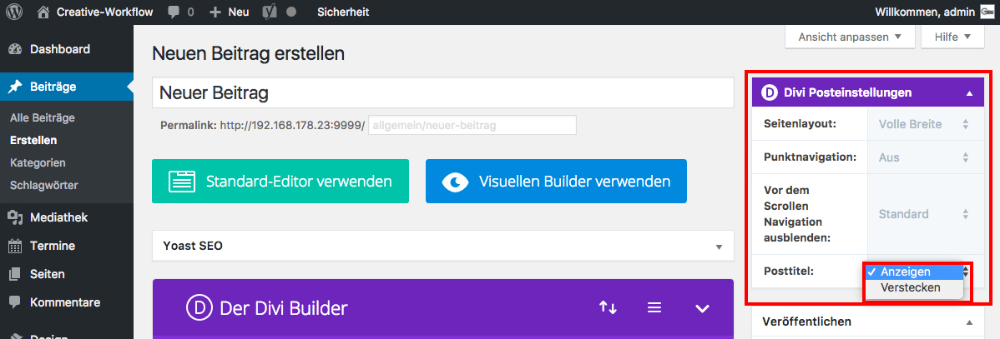

## Page-Builder Einstellungen

Sobald der Divi-Builder aktiviert wurde, verändert sich das Menü im Widget _**Divi Posteinstellungen**_.

Z.B. kannst du die Beitragsüberschrift (Posttitel) _**verstecken**_.

