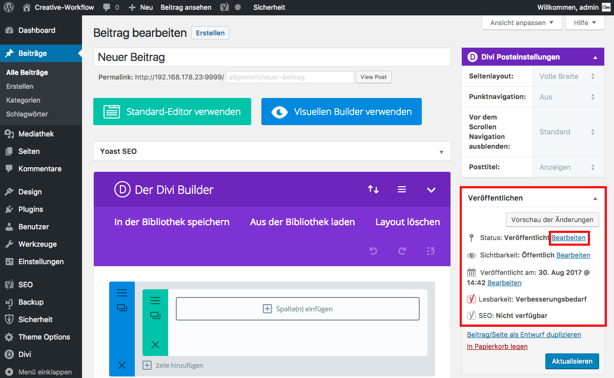

## Wieder "Verstecken" *(1/3)*

Um eine Seite/einen Beitrag nach dem Veröffentlichen wieder zu "verstecken", klicke im Widget "Veröffentlichen" unter dem Punkt "Status: Veröffentlicht" auf "Bearbeiten".

