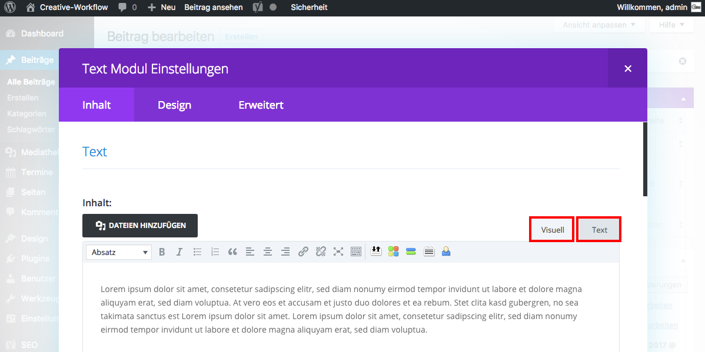

## WYSIWYG vs. Code

Das Text-Modul bietet dir die Möglichkeit Texte mittels eines **WYSIWYG-Editors** - Tab _**Visuell**_ - oder direkt durch **Html-Code Eingabe** im Tab _**Text**_ zu erstellen.

**Hinweis**: WYSIWYG bedeutet "what you see is what you get".

