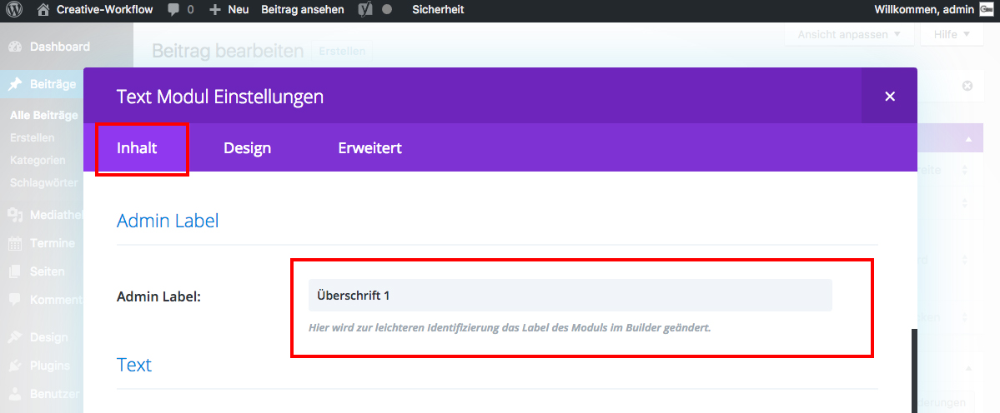

## Admin Label

Das **Admin-Label** dient der Ordnung im Page-Builder.

Es ist sinnvoll, das Admin Label aussagekräftig zu benennen, um einen bestimmten Text später leichter wiederzufinden.

Scrolle dazu im Tab _**Inhalt**_ zu dem Punkt _**Admin Label**_ und vergib einen Namen.

