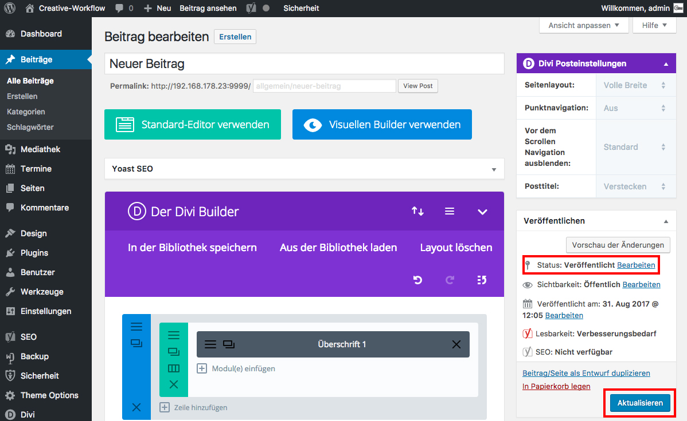

## Seite/Beitrag speichern

Vorher hast du die Änderungen im Text-Modul gespeichert, aber noch nicht die Änderung des Beitrages selbst.

Klicke dazu auf _**Aktualisieren**_ um den Beitrag zu speichern.

