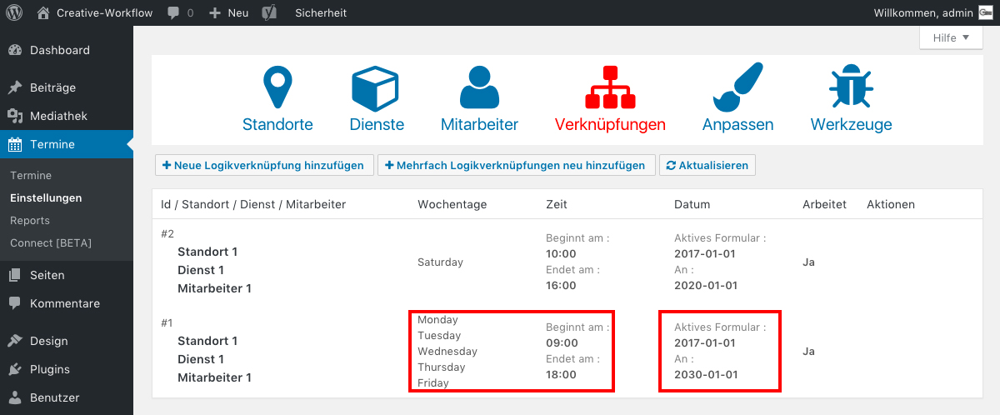

## Zeiträume bearbeiten *(2/4)*

Du siehst z.B. dass für die Tage Montag bis Freitag ein Buchungszeitraum von 9 bis 18 Uhr eingestellt ist.

Außerdem siehst du rechts daneben, für welchen Datumsbereich dieser Buchungszeitraum gültig ist.

