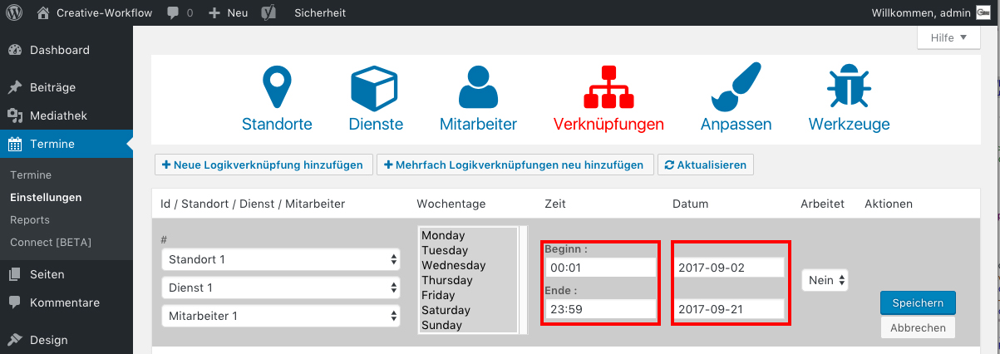

## Zeitraum definieren *(3/5)*

Wähle als Beginn die Stunde **0** und Minute **1**.

Wähle als Ende die Stunde **23** und die Minute **59**.

Wähle das Start- und End-Datum deines Urlaubs, in diesem Fall vom **2.9.2017** bis zum **21.9.2017**.

