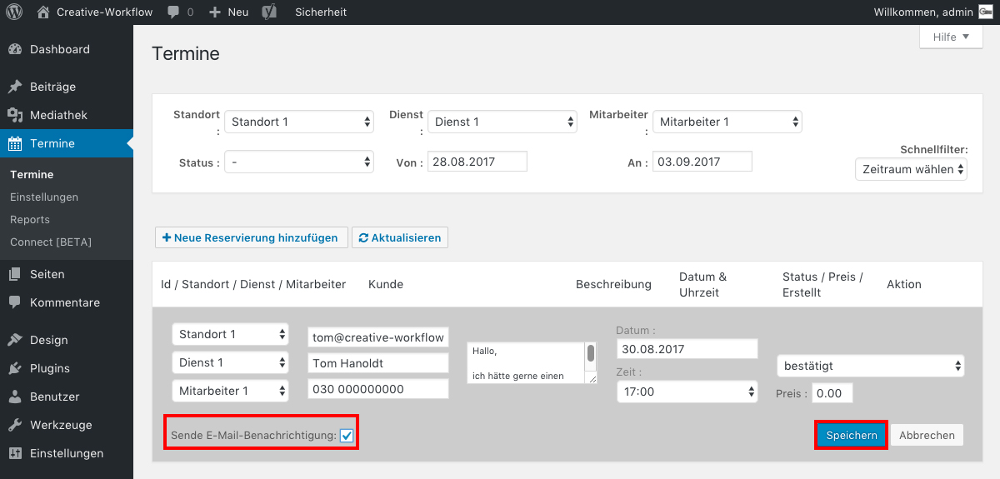

## Termin bearbeiten *(3/3)*

Wenn du fertig mit der Bearbeitung bist, klicke auf "Speichern".

**Hinweis:** Achte darauf das Häkchen "Sende E-Mail-Benachrichtigung" zu setzen, wenn du möchtest, dass dein Kunde und auch du eine E-Mail über die Statusänderungen erhalten.

