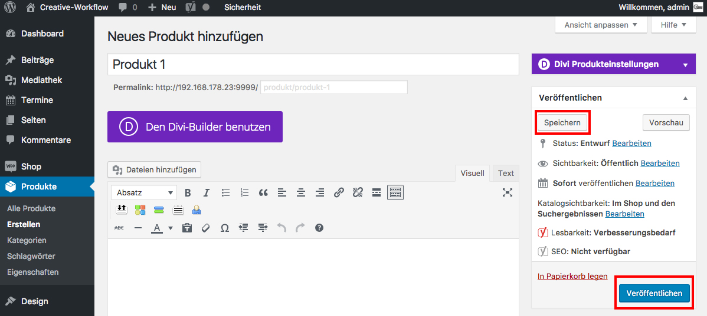

## Neues Produkt speichern

Klicke auf _**Speichern**_ (wenn du das Produkt nur als Entwurf gespeichert haben möchtest) - oder auf _**Veröffentlichen**_ (wenn du das Produkt publizieren möchtest).

