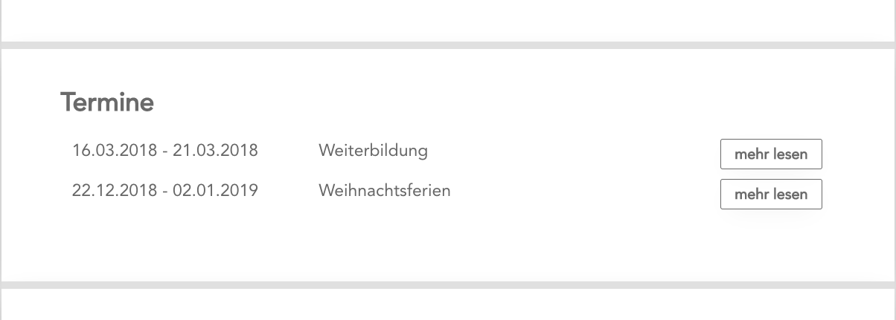

## Das News-List-Modul

Das *News-List-Modul* wird meist auf der Kontaktseite angezeigt und gibt einen Überblick über aktuelle und zukünftige Ereignisse.

Wenn man auf ein Ereignis klickt, wird eine eigene Seite mit allen Informationen zu dem Ereignis angezeigt.

