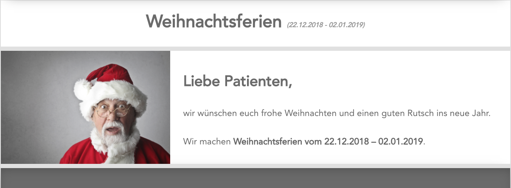

## Das News-Entry-Modul

Wenn man auf ein Ereignis auf der *News-List-Modul*-Übersicht klickt, wird eine eigene Seite mit allen Informationen zu dem Ereignis angezeigt.

Zu den Informationen gehört ein Bild, eine Überschrift sowie das Start- und End-Datum und ein Text.

