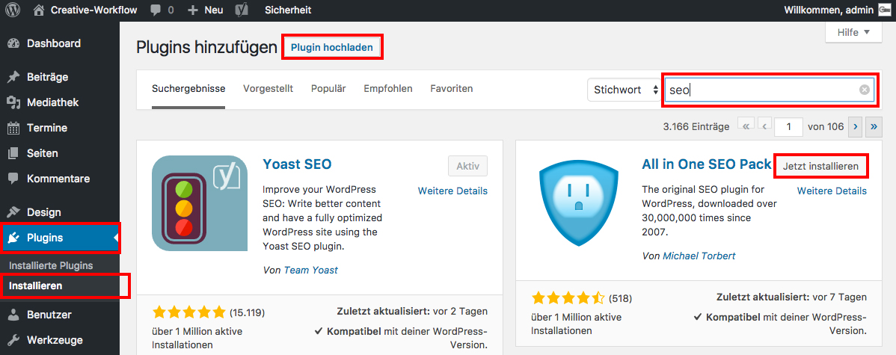

## Plugins installieren

Um ein Plugin zu installieren, navigiere im Seitenmenü zu _**Plugins/Installieren**_.

Im Suchfenster kannst du das Plugin suchen, das du installieren möchtest. Klicke auf _**Jetzt installieren**_ und danach auf _**Aktivieren**_, damit der Funktionsumfang von Wordpress um das ausgewählte Plugin erweitert wird.

Wenn du ein Plugin manuell hochladen möchtest, klicke auf _**Plugin hochladen**_ und danach auf _**Aktivieren**_.

