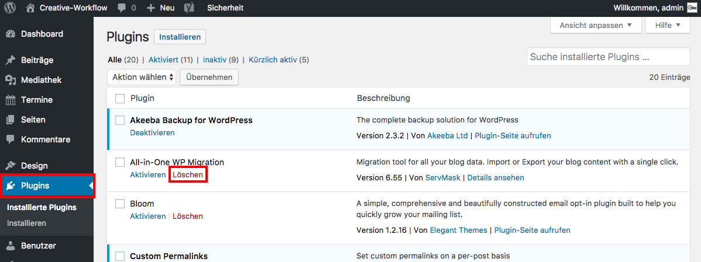

## Plugins deinstallieren

Um ein Plugin zu deinstallieren, navigiere im Seitenmenü zu _**Plugins**_.

Ein aktiviertes Plugin muß zuerst deaktiviert werden bevor es gelöscht werden kann.

Ist es deaktiviert, klicke auf die Option _**Löschen**_ um das Plugin zu entfernen.

