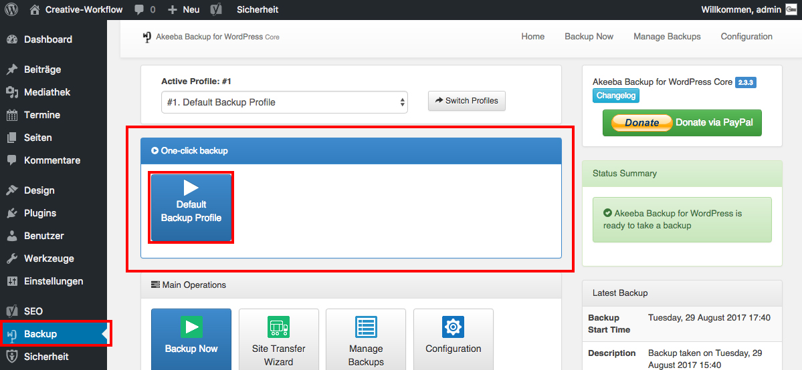

## Erstellung eines Backups *(1/2)*

Ein **Backup** erstellst du, indem du im Seitenmenü zu _**Backup**_ navigierst und im Widget _**One-click backup**_ auf _**Default Backup Profile**_ klickst.

**Heinweis**: Wenn du im oberen Bereich auf "Manage Backups" klickst, sieht du eine Übersicht deiner gespeicherten Backups.
